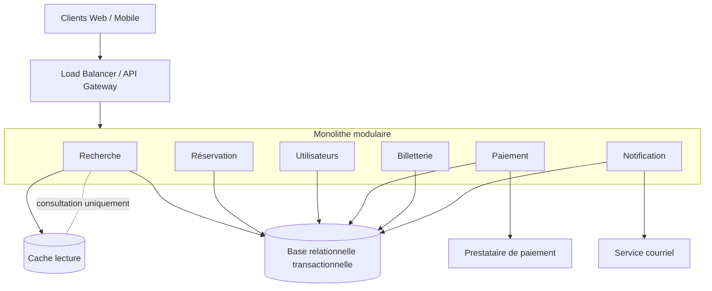

# Diagramme d'architecture globale

```mermaid
flowchart TB
    U[Clients Web / Mobile]
    LB[Load Balancer / API Gateway]

    subgraph App[Monolithe modulaire]
        Search[Recherche]
        Reservation[Réservation]
        Users[Utilisateurs]
        Payment[Paiement]
        Ticket[Billetterie]
        Notification[Notification]
    end

    Cache[(Cache lecture)]
    DB[(Base relationnelle transactionnelle)]
    PSP[Prestataire de paiement]
    Mail[Service courriel]

    U --> LB
    LB --> App

    Search --> Cache
    Search --> DB
    Reservation --> DB
    Users --> DB
    Payment --> DB
    Ticket --> DB
    Notification --> DB

    Payment --> PSP
    Notification --> Mail

    Cache -. consultation uniquement .- Search
```

La base transactionnelle reste la source de vérité pour l'inventaire et les réservations. Le cache ne confirme jamais une vente.
