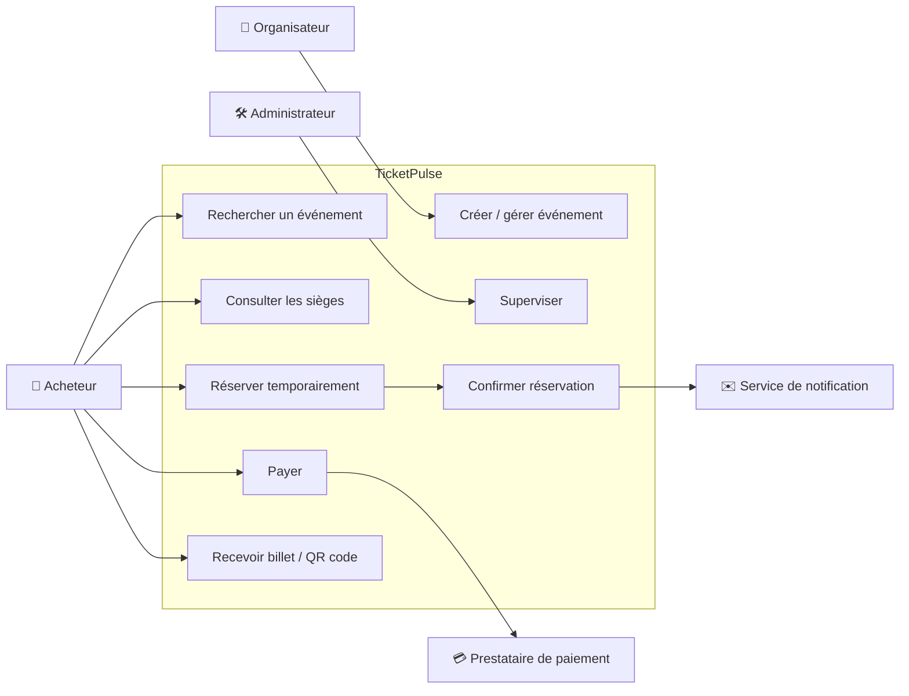

# Diagramme de cas d'utilisation

```mermaid
flowchart LR
    A[👤 Acheteur]
    O[👤 Organisateur]
    P[💳 Prestataire de paiement]
    N[✉️ Service de notification]
    Admin[🛠️ Administrateur]

    subgraph TicketPulse
        R[Rechercher un événement]
        S[Consulter les sièges]
        H[Réserver temporairement]
        Pay[Payer]
        T[Recevoir billet / QR code]
        E[Créer / gérer événement]
        M[Superviser]
        C[Confirmer réservation]
    end

    A --> R
    A --> S
    A --> H
    A --> Pay
    A --> T

    O --> E
    Admin --> M

    Pay --> P
    C --> N
    H --> C
```

**Point critique :** la réservation et la confirmation doivent passer par le mécanisme transactionnel du système afin d'éviter toute double-vente.
