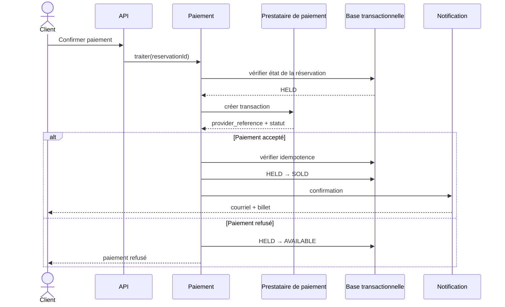

# Diagramme de séquence — Paiement

```mermaid
sequenceDiagram
    actor Client
    participant API
    participant Paiement
    participant PSP as Prestataire de paiement
    participant DB as Base transactionnelle
    participant Notification

    Client->>API: Confirmer paiement
    API->>Paiement: traiter(reservationId)
    Paiement->>DB: vérifier état de la réservation
    DB-->>Paiement: HELD
    Paiement->>PSP: créer transaction
    PSP-->>Paiement: provider_reference + statut

    alt Paiement accepté
        Paiement->>DB: vérifier idempotence
        Paiement->>DB: HELD → SOLD
        Paiement->>Notification: confirmation
        Notification-->>Client: courriel + billet
    else Paiement refusé
        Paiement->>DB: HELD → AVAILABLE
        Paiement-->>Client: paiement refusé
    end
```

Le traitement doit être idempotent : répéter la même confirmation ne doit pas générer une seconde vente.
