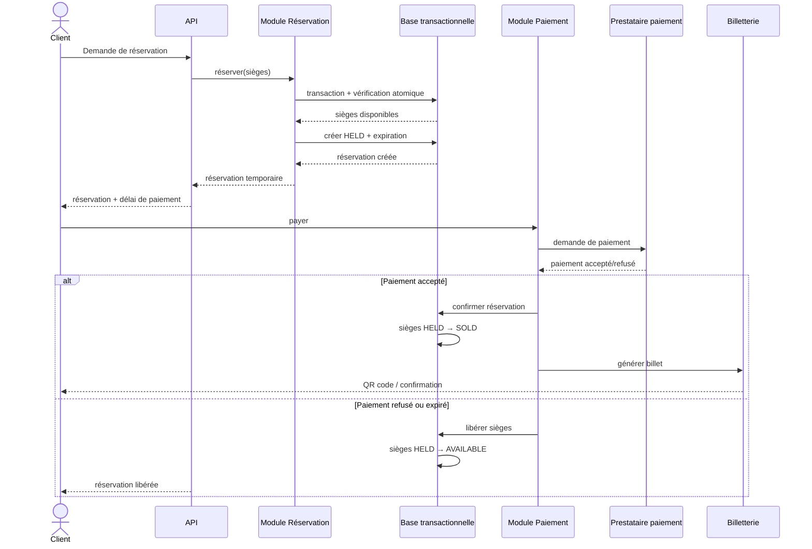

# Diagramme de séquence — Réservation

```mermaid
sequenceDiagram
    actor Client
    participant API
    participant Reservation as Module Réservation
    participant DB as Base transactionnelle
    participant Payment as Module Paiement
    participant PSP as Prestataire paiement
    participant Ticket as Billetterie

    Client->>API: Demande de réservation
    API->>Reservation: réserver(sièges)
    Reservation->>DB: transaction + vérification atomique
    DB-->>Reservation: sièges disponibles
    Reservation->>DB: créer HELD + expiration
    DB-->>Reservation: réservation créée
    Reservation-->>API: réservation temporaire
    API-->>Client: réservation + délai de paiement

    Client->>Payment: payer
    Payment->>PSP: demande de paiement
    PSP-->>Payment: paiement accepté/refusé

    alt Paiement accepté
        Payment->>DB: confirmer réservation
        DB->>DB: sièges HELD → SOLD
        Payment->>Ticket: générer billet
        Ticket-->>Client: QR code / confirmation
    else Paiement refusé ou expiré
        Payment->>DB: libérer sièges
        DB->>DB: sièges HELD → AVAILABLE
        API-->>Client: réservation libérée
    end
```
